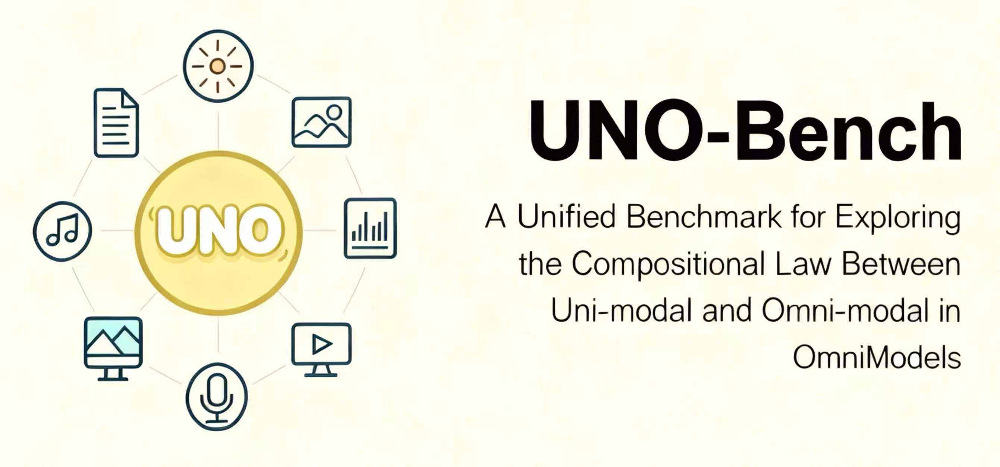
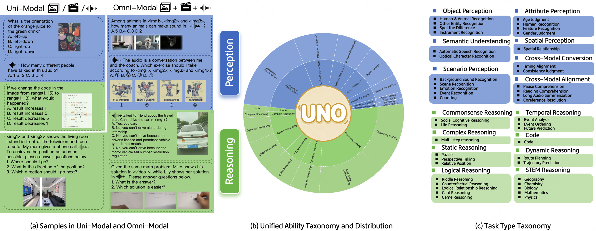
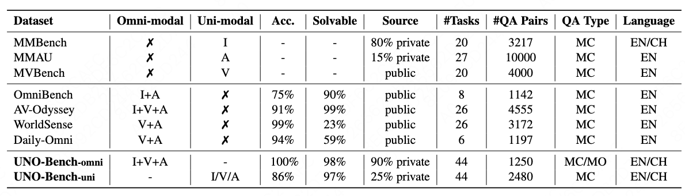
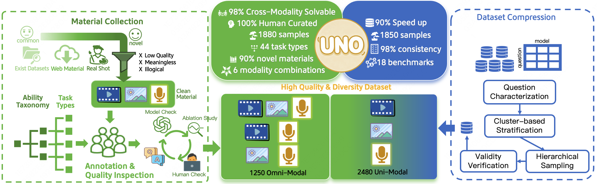
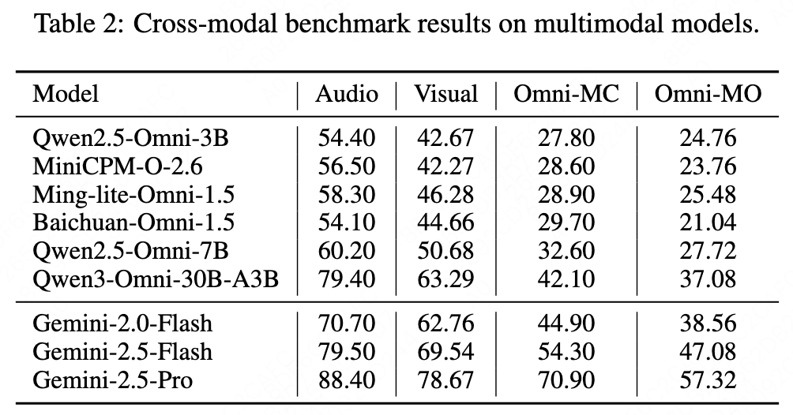
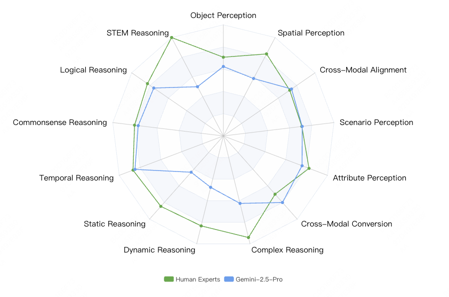
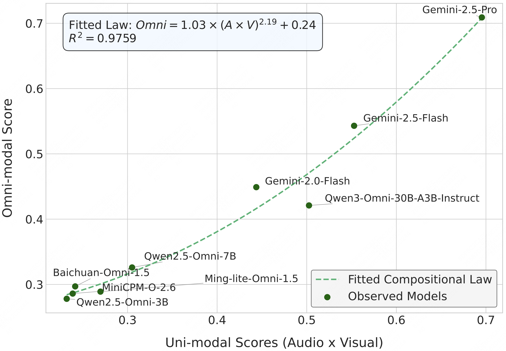

<h1> UNO-Bench: A Unified Benchmark for Exploring the Compositional Law Between Uni-modal and Omni-modal in OmniModels</h1>
<p align="center" width="100%">

</p>

<font size=7><div align='center' >  
[[📖 Github Paper](./paper.pdf)] 
[[📖 ArXiv Paper(updating)](https://arxiv.org/abs/2510.18915)] 
[[📊 UNO-Bench Data(comming soon)](.)] 
</div></font>

## 👀 UNO-Bench Overview
Multimodal Large Language Models are advancing from uni-modal to omni-modal understanding, integrating visual, audio, and language modalities. However, the relationship between uni-modal and omni-modal performance needs clarification, necessitating thorough evaluation to enhance omni model intelligence. We introduce **UNO-Bench**, a novel benchmark that evaluates both uni-modal and omni-modal capabilities. It includes 3730 human-curated samples across 44 task types and features an innovative multi-step open-ended question type for assessing complex reasoning. Additionally, we propose a general scoring model supporting 6 question types for automatic evaluation with 95% accuracy. Experimental results reveal a compositional law between cross-modal and uni-modal performance, with omni-modal capability acting as a bottleneck for weak models but promoting synergy in strong models.

<div>
<p align="center">
  
</p>
</div>

The MultiModal Benchmarks compare image (I), audio (A), video (V), and text (T) modalities, reporting omni-modal solution accuracy (Acc.) and percentage (Solvable). Source origin affects data contamination, with private sources being safer. QA types are multi-choice (MC) and multi-step open-ended (MO), in English (EN) and Chinese (CH). UNO-Bench features 1250 omni-modal (-omni) and 2480 uni-modal (-uni) samples.

<div>
<p align="center">
  
</p>
</div>


## 📊 Dataset Construction

**Material Collection**

Our materials feature three key characteristics: **a. Diverse Sources**—primarily real-world photos and videos from crowdsourcing, supplemented by copyright-free websites and high-quality public datasets like MMVU, LongVideoBench, and VideoVista. **b. Rich and Diverse Topics**—spanning society, culture, art, life, literature, and science. **c. Live-Recorded Audio**—dialogue recorded by over 20 human speakers, ensuring rich audio features that mirror real-world vocal diversity.

**QA Annotation**

Our annotators include human experts and skilled crowd-sourced users. Human experts bring extensive experience in cross-modal data and model understanding, ensuring professional and specific data. Crowd-sourced users, mainly college students, offer authentic and diverse data due to their experience with multi-modal models and varied backgrounds.

**Quality Inspection**

To ensure data quality, we use a multi-stage quality assurance system combining automated tools and manual review. Each question undergoes three independent inspections: a preliminary model check filters out ambiguous or non-conforming questions; modality ablation experiments test cross-modality solvability by removing one modality; and final manual inspection and revision ensure accuracy.

<div>
<p align="center">
  
</p>
</div>

## 📍 Dataset Examples

UNO-Bench is consists of multi-choice questions and multi-step open-ended questions. 

**A multi-choice question example**

<!--
```
{
    "task": "Life Reasoning",
    "ability": "General Reasoning",
    "question": "<audio_1><video_1>A Tyndall effect-like experiment refers to: \"In a medium containing tiny particles (such as milk or smoke), a beam of light is used to illuminate it, causing the particles to scatter the light and reveal its trajectory, like a 'path of light'\". Please combine the information above with the video and audio, and select the correct answer from the options below to respond to the question in the audio:",
    "choices": [
      "A. Yes, it will; because the liquid replaced in the audio is mineral water, which has the same composition as the liquid in the cup from the video, thus the same phenomenon can be produced.",
      "B. No, it will not; because in the liquid replaced in the audio, only a bright path of light is visible.",
      "C. No, it will not; because the liquid replaced in the audio is a strongly acidic substance, and a neutralization reaction will occur in the end.",
      "D. Yes, it will; because a bright path of light can also be seen in the liquid replaced in the audio."
    ],
    "images": [],
    "videos": [
      "assets/videos/video1-1.mp4"
    ],
    "audios": [
      "assets/audios/audio1-1.mp3"
    ],
    "answer": "B",
    "audio_type": "speek",
    "audio_content": "If the liquid in the video is replaced with diluted milk, with all other conditions remaining the same, would the phenomenon shown in the video still occur? Why?",
    "modality": "text-video-audio",
    "problem_modality": "audio"
}
```-->

**Question**: A Tyndall effect-like experiment refers to: "In a medium containing tiny particles (such as milk or smoke), a beam of light is used to illuminate it, causing the particles to scatter the light and reveal its trajectory, like a 'path of light'". Please combine the information above with the video and audio, and select the correct answer from the options below to respond to the question in the audio:
[audio1-1.mp3](https://github.com/user-attachments/files/23119884/audio1-1.mp3) (If the liquid in the video is replaced with diluted milk, with all other conditions remaining the same, would the phenomenon shown in the video still occur? Why?)

A. Yes, it will; because the liquid replaced in the audio is mineral water, which has the same composition as the liquid in the cup from the video, thus the same phenomenon can be produced.

**B. No, it will not; because in the liquid replaced in the audio, only a bright path of light is visible.**

C. No, it will not; because the liquid replaced in the audio is a strongly acidic substance, and a neutralization reaction will occur in the end.

D. Yes, it will; because a bright path of light can also be seen in the liquid replaced in the audio.

[video1-1.mp4](https://github.com/user-attachments/assets/6c728423-01da-454e-b795-52aef6ea9cba)

---

**A multi-step open-ended question example**
<!--
```
{
    "task": "Timing Alignment",
    "ability": "Cross-Modal Alignment",
    "question": "Here is the text information: \"One day, David went to a lottery store and bought a scratch card. One of the winning rules for this scratch card is: 'Scratch off the cover film. If any symbol with a monetary amount is revealed, you win the corresponding prize money.' Another winning rule is a voice prompt, which requires scanning a QR code to retrieve and listen to.\" <audio_1> is the audio information David got after scanning the QR code. <image_1> is the picture of the scratch card David bought. Please answer the questions based on the text, audio, and image information:\n1. How many types of winning symbols are on the scratch card David bought? (Please answer in the format \"x types\", where x is an Arabic numeral).\n2. What is the total amount of prize money that David won?",
    "choices": [],
    "images": [
      "assets/images/image2-1.png"
    ],
    "videos": [],
    "audios": [
      "assets/audios/audio2-1.mp3"
    ],
    "answer": "1. 3 types (4 points)\n2. 350 yuan (6 points)",
    "audio_type": "speek",
    "audio_content": "After scratching off the covering film, a peach pattern represents a prize of 50 yuan, and a Chinese knot pattern represents a prize of 100 yuan. ",
    "modality": "text-image-audio",
    "problem_modality": "text"
}
``` -->

**Question:** Here is the text information: "One day, David went to a lottery store and bought a scratch card. One of the winning rules for this scratch card is: 'Scratch off the cover film. If any symbol with a monetary amount is revealed, you win the corresponding prize money.' Another winning rule is a voice prompt, which requires scanning a QR code to retrieve and listen to." [audio2-1.mp3](https://github.com/user-attachments/files/23120081/audio2-1.mp3)(After scratching off the covering film, a peach pattern represents a prize of 50 yuan, and a Chinese knot pattern represents a prize of 100 yuan.) is the audio information David got after scanning the QR code. <image_1> is the picture of the scratch card David bought. Please answer the questions based on the text, audio, and image information:

1. How many types of winning symbols are on the scratch card David bought? (Please answer in the format "x types", where x is an Arabic numeral).
   
2. What is the total amount of prize money that David won?

**1. 3 types (4 points)**
**2. 350 yuan (6 points)**


## 🔍 Results

Our main evaluation reveals a clear performance hierarchy where proprietary models, particularly Gemini-2.5-Pro, establish the state-of-the-art across all benchmarks.
<p align="center">
  
</p>

**Finding 1. 📍Gemini-2.5-Pro demonstrates human-like perception in omni-modal understanding but lags in reasoning ability.** The model's performance is only 8.3% lower than human experts, indicating comparable intelligence. Interestingly, humans excel more in reasoning (81.3%) than perception (74.3%), contrasting with the model's strengths.

<p align="center">
  
</p>

**Finding 2. 📍Compositional Law: Omni-modal capability effectiveness correlates with the product of individual modality performances following a power-law.** The observed omni-modal scores align closely with the product of uni-modal scores, as shown by the fitted law (dashed line), achieving an impressive $R^2=0.9759$. The convex, accelerating curve illustrates the power-law synergy.

$$
P_{\text{Omni}} = C \cdot (P_{\text{Audio}} \times P_{\text{Visual}})^{\alpha} + b
$$
<p align="center">
  
</p>

## 📌 Checklist

- **Data**
  - ✅ paper
  - ✅ dataset examples
  - 🚧 Omni-MC: Omni Multi-choice Question Dataset
  - 🚧 Omni-MO: Omni Multi-step Open-ended Question Dataset
- **Code**
  - 🚧 Evaluation Toolkit
  - 🚧 Model Weights and Configurations

## 🖊️ Citation

If you find our work helpful for your research, please consider citing our work.
```bash
@misc{chen2025unobench,
      title={UNO-Bench: A Unified Benchmark for Exploring the Compositional Law Between Uni-modal and Omni-modal in OmniModels}, 
      author={Chen Chen and ZeYang Hu and Fengjiao Chen and Liya Ma and Jiaxing Liu and Xiaoyu Li and Xuezhi Cao},
      year={2025},
      eprint={2510.18915},
      archivePrefix={arXiv},
      primaryClass={cs.CL},
      url={https://arxiv.org/abs/2510.18915}, 
}
```

## 🔮 Data Statements

The majority of our materials are real-world photos and videos collected through crowdsourcing, while a small fraction comes from high-quality public datasets such as [MMVU](https://arxiv.org/abs/2501.12380), [LongVideoBench](https://arxiv.org/abs/2407.15754), [VideoVista](https://arxiv.org/abs/2504.17821), [WorldSense](https://arxiv.org/abs/2502.04326) and [AV-Odyssey](https://arxiv.org/abs/2412.02611). Additionally, We employ 18 publicly available benchmarks for compressing visual datasets and audio datasets, including [RealWorldQA](https://huggingface.co/datasets/xai-org/RealworldQA), [MME](https://arxiv.org/abs/2306.13394), [SeedBench](https://arxiv.org/abs/2307.16125), [OCRBench](https://arxiv.org/abs/2305.07895), [Fox](https://arxiv.org/abs/2405.14295), [DocLocal4k](https://arxiv.org/abs/2307.02499), [MMMU](https://arxiv.org/abs/2311.16502), [MMMU-Pro](https://arxiv.org/abs/2409.02813), [CMMMU](https://arxiv.org/abs/2401.11944), [MathVista](https://arxiv.org/abs/2310.02255), [MathVision](https://arxiv.org/abs/2402.14804), [ScienceVista](https://arxiv.org/abs/2501.12599), [GMAI-MMBench](https://arxiv.org/abs/2408.03361), [ReMi](https://arxiv.org/abs/2406.09175),  [MuirBench](https://arxiv.org/abs/2406.09411), [MMAU](https://arxiv.org/abs/2410.19168), [MMSU](https://arxiv.org/abs/2506.04779) and [SDQA](https://arxiv.org/abs/2109.12072).

## 📐 Acknowledgments

We hereby express our appreciation to the LongCat Team EVA Committee for their valuable assistance, guidance, and suggestions throughout the course of this work.


