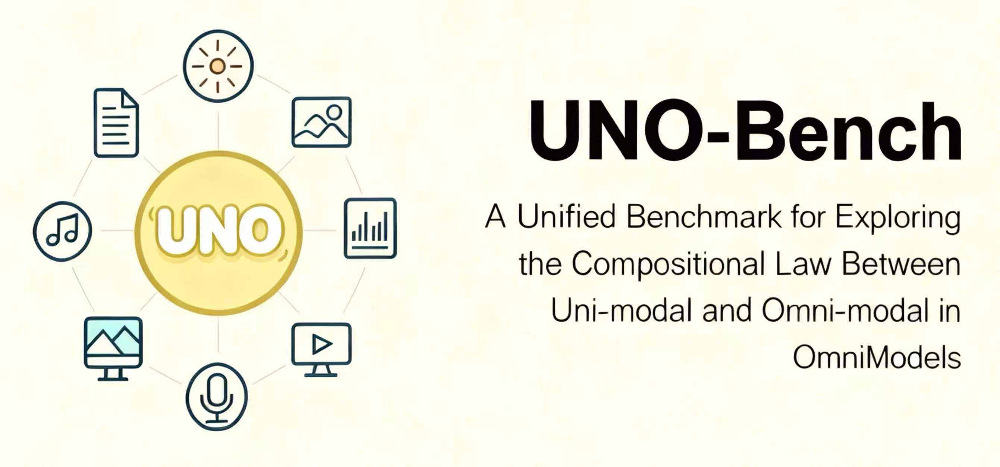
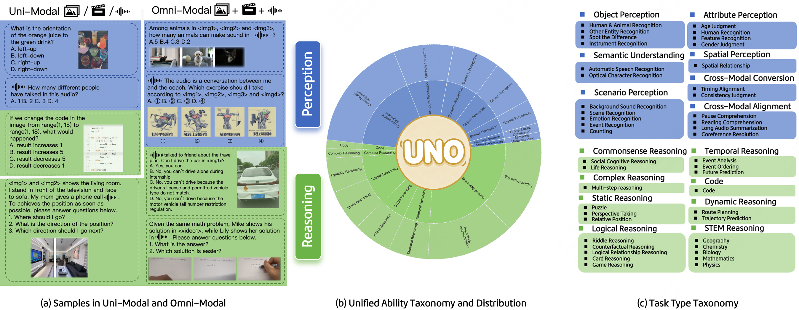
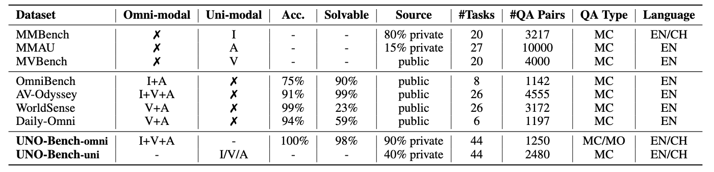
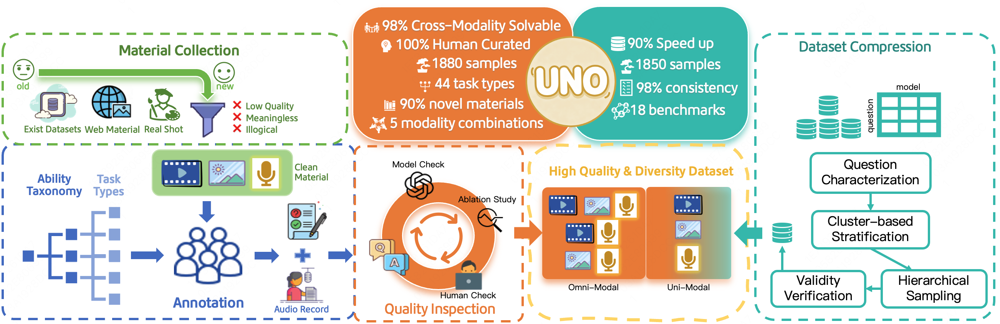
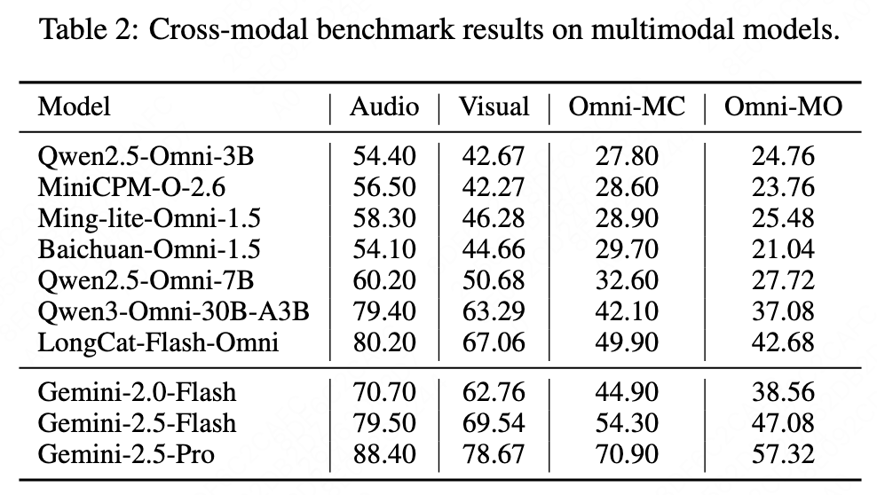
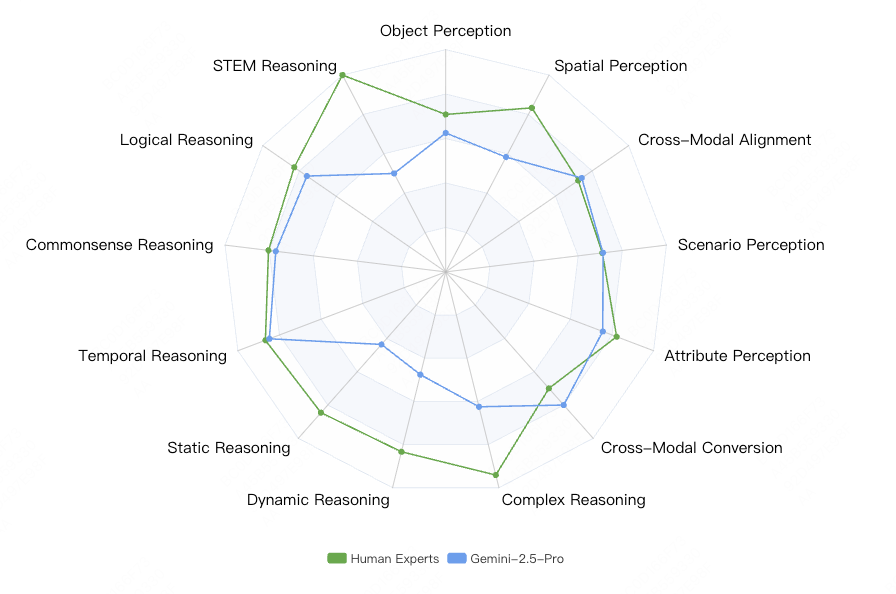
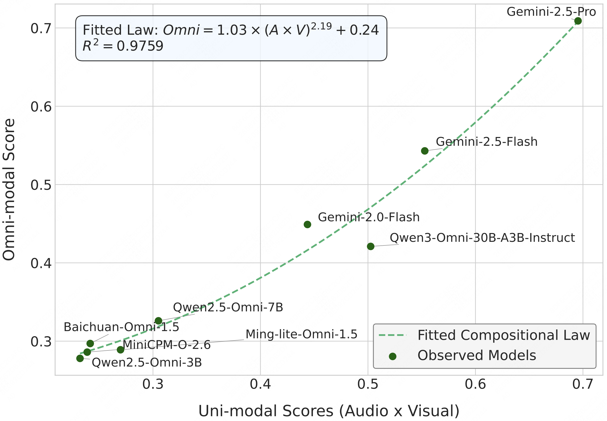

<h1> UNO-Bench: A Unified Benchmark for Exploring the Compositional Law Between Uni-modal and Omni-modal in OmniModels</h1>
<p align="center" width="100%">

</p>

<font size=7><div align='center' >  
[[📑 Github Paper](./UNO-Bench.pdf)] 
[🌐 ArXiv Paper(updating)]
[📊 UNO-Bench Data(comming soon)] 
</div></font>

## 👀 UNO-Bench Overview
Multimodal Large Language Models are advancing from uni-modal to omni-modal understanding, integrating visual, audio, and language modalities. However, the relationship between uni-modal and omni-modal performance needs clarification, necessitating thorough evaluation to enhance omni model intelligence. We introduce **UNO-Bench**, a novel benchmark that evaluates both uni-modal and omni-modal capabilities. It includes 3730 human-curated samples across 44 task types and features an innovative multi-step open-ended question type for assessing complex reasoning. Additionally, we propose a general scoring model supporting 6 question types for automatic evaluation with 95% accuracy. Experimental results reveal a compositional law between omni-modal and uni-modal performance, with omni-modal capability acting as a bottleneck for weak models but promoting synergy in strong models.

<div>
<p align="center">
  
</p>
</div>

The MultiModal Benchmarks compare image (I), audio (A), video (V), and text (T) modalities, reporting omni-modal solution accuracy (Acc.) and percentage (Solvable). Source origin affects data contamination, with private sources being safer. QA types are multi-choice (MC) and multi-step open-ended (MO), in English (EN) and Chinese (CH). UNO-Bench features 1250 omni-modal (-omni) and 2480 uni-modal (-uni) samples.

<div>
<p align="center">
  
</p>
</div>


## 📊 Dataset Construction

**Material Collection**

Our materials feature three key characteristics: **a. Diverse Sources**—primarily real-world photos and videos from crowdsourcing, supplemented by copyright-free websites and high-quality public datasets like MMVU, LongVideoBench, and VideoVista. **b. Rich and Diverse Topics**—spanning society, culture, art, life, literature, and science. **c. Live-Recorded Audio**—dialogue recorded by over 20 human speakers, ensuring rich audio features that mirror real-world vocal diversity.

**QA Annotation**

Our annotators include human experts and skilled crowd-sourced users. Human experts bring extensive experience in cross-modal data and model understanding, ensuring professional and specific data. Crowd-sourced users, mainly college students, offer authentic and diverse data due to their experience with multi-modal models and varied backgrounds.

**Quality Inspection**

To ensure data quality, we use a multi-stage quality assurance system combining automated tools and manual review. Each question undergoes three independent inspections: a preliminary model check filters out ambiguous or non-conforming questions; modality ablation experiments test cross-modality solvability by removing one modality; and final manual inspection and revision ensure accuracy.

<div>
<p align="center">
  
</p>
</div>

## 📍 Dataset Examples

UNO-Bench is consists of multi-step open-ended question samples and multi-choice question samples: 

---

**Question:** Given that Xiaoming has 5 different colors, he will use these colors to color the four regions in the figure. If Xiaoming colors Region I first, there are 5 ways to color it. Then he colors Regions II and IV, and finally Region III. Based on the information above, the requirements in audio, and the image, answer the following questions:

1. When Regions II and IV are colored with the same color, how many coloring methods are there?
2. When Regions II and IV are colored with different colors, how many coloring methods are there?
3. In summary, what is the total number of coloring methods?"

[audio1.mp3](https://github.com/user-attachments/files/23122352/audio1.mp3)(Audio Content: In the provided image, any two regions that share a common border cannot be the same color, and each region must be colored with only one color)

<p align="center">

</p>

**Answer:**

1. 80 (4 points)

2. 180 (4 points)

3. 260 (2 points)

---

**Question**: 视频展示了我最近在玩的一款游戏，玩家通过手指在屏幕上划动，来切开各种飞来的水果，如西瓜、凤梨、猕猴桃、草莓、香蕉等，切中不同的水果会有不同的得分，如没切到，则不得分。已知切一个猕猴桃是2分，一个草莓3分，一个杨桃20分，一个橙子6分。音频中有其他水果的得分规则。请根据以上所有信息、视频和音频回答我，视频中这把游戏一共拿了多少分？请从以下选项中，选出一个正确答案：

A. 30分

**B. 35分**

C. 37分

D. 40分

[audio2.mp3](https://github.com/user-attachments/files/23122214/audio1.mp3)（音频内容：一个西瓜10分，一个香蕉2分，一个青苹果1分，一个柠檬3分，一个椰子5分，一个红苹果3分，一个桃子1分）

[video2.mp4](https://github.com/user-attachments/assets/2baafc12-b14a-4fd1-831b-9517589a766b)


## 🔍 Results

Our main evaluation reveals a clear performance hierarchy where proprietary models, particularly Gemini-2.5-Pro, establish the state-of-the-art across all benchmarks.
<p align="center">
  
</p>

**Finding 1. 📍Gemini-2.5-Pro demonstrates human-like perception in omni-modal understanding but lags in reasoning ability.** The model's performance is only 8.3% lower than human experts, indicating comparable intelligence. Interestingly, humans excel more in reasoning (81.3%) than perception (74.3%), contrasting with the model's strengths.

<p align="center">
  
</p>

**Finding 2. 📍Compositional Law: Omni-modal capability effectiveness correlates with the product of individual modality performances following a power-law.** The observed omni-modal scores align closely with the product of uni-modal scores, as shown by the fitted law (dashed line), achieving an impressive $R^2=0.9759$. The convex, accelerating curve illustrates the power-law synergy.

$$
P_{\text{Omni}} = C \cdot (P_{\text{Audio}} \times P_{\text{Visual}})^{\alpha} + b
$$
<p align="center">
  
</p>

## 📌 Checklist

- **Data**
  - ✅ Paper
  - ✅ Dataset Examples
  - 🚧 Benchmark Leaderboard
  - 🚧 Omni-Bench Data
- **Code**
  - 🚧 Evaluation Toolkit
  - 🚧 Model Weights and Configurations

## 🖊️ Citation

If you find our work helpful for your research, please consider citing our work.
```bash
@misc{chen2025unobench,
      title={UNO-Bench: A Unified Benchmark for Exploring the Compositional Law Between Uni-modal and Omni-modal in OmniModels}, 
      author={Chen Chen and ZeYang Hu and Fengjiao Chen and Liya Ma and Jiaxing Liu and Xiaoyu Li and Xuezhi Cao},
      year={2025},
      eprint={2510.18915},
      archivePrefix={arXiv},
      primaryClass={cs.CL},
      url={arxiv}, 
}
```

## 🔮 Data Statements

The majority of our materials are real-world photos and videos collected through crowdsourcing, while a small fraction comes from high-quality public datasets such as [MMVU](https://arxiv.org/abs/2501.12380), [LongVideoBench](https://arxiv.org/abs/2407.15754), [VideoVista](https://arxiv.org/abs/2504.17821), [WorldSense](https://arxiv.org/abs/2502.04326) and [AV-Odyssey](https://arxiv.org/abs/2412.02611). Additionally, We employ 18 publicly available benchmarks for compressing visual datasets and audio datasets, including [RealWorldQA](https://huggingface.co/datasets/xai-org/RealworldQA), [MME](https://arxiv.org/abs/2306.13394), [SeedBench](https://arxiv.org/abs/2307.16125), [OCRBench](https://arxiv.org/abs/2305.07895), [Fox](https://arxiv.org/abs/2405.14295), [DocLocal4k](https://arxiv.org/abs/2307.02499), [MMMU](https://arxiv.org/abs/2311.16502), [MMMU-Pro](https://arxiv.org/abs/2409.02813), [CMMMU](https://arxiv.org/abs/2401.11944), [MathVista](https://arxiv.org/abs/2310.02255), [MathVision](https://arxiv.org/abs/2402.14804), [ScienceVista](https://arxiv.org/abs/2501.12599), [GMAI-MMBench](https://arxiv.org/abs/2408.03361), [ReMi](https://arxiv.org/abs/2406.09175),  [MuirBench](https://arxiv.org/abs/2406.09411), [MMAU](https://arxiv.org/abs/2410.19168), [MMSU](https://arxiv.org/abs/2506.04779) and [SDQA](https://arxiv.org/abs/2109.12072).

## 📐 Acknowledgments

We hereby express our appreciation to the LongCat Team EVA Committee for their valuable assistance, guidance, and suggestions throughout the course of this work.


