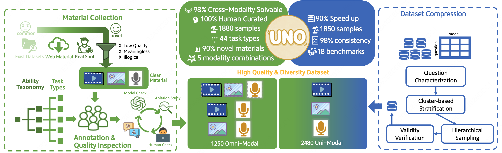

<h1> UNO-Bench: A Unified Benchmark for Exploring the Compositional Law Between Uni-modal and Omni-modal in Omni Models</h1>
<p align="center" width="100%">

</p>

<div align="center" style="line-height: 1;">
  <a target="_blank" href='https://meituan-longcat.github.io/UNO-Bench'></a>
  <a target="_blank" href='https://arxiv.org/abs/2510.18915'></a>
  <a target="_blank" href='https://huggingface.co/datasets/meituan-longcat/UNO-Bench'></a>
  <a href='./'></a>
</div>


## 👀 UNO-Bench Overview
Multimodal Large Languages models have been progressing from uni-modal understanding toward unifying visual, audio and language modalities, collectively termed omni models. However, the correlation between uni-modal and omni-modal remains unclear, which requires comprehensive evaluation to drive omni model's intelligence evolution. In this work, we introduce a novel, high-quality, and **UN**ified **O**mni model benchmark, **UNO-Bench**. This benchmark is designed to effectively evaluate both **UN**i-modal and **O**mni-modal capabilities under a unified ability taxonomy, spanning 44 task types and 5 modality combinations. It includes 1250 human curated samples for omni-modal with 98% cross-modality solvability, and 2480 enhanced uni-modal samples. The human-generated dataset is well-suited to real-world scenarios, particularly within the Chinese context, whereas the automatically compressed dataset offers a 90% increase in speed and maintains 98% consistency across 18 public benchmarks. In addition to traditional multi-choice questions, we propose an innovative multi-step open-ended question format to assess complex reasoning. A general scoring model is incorporated, supporting 6 question types for automated evaluation with 95% accuracy. Experimental result shows the **Compositional Law** between omni-modal and uni-modal performance and the omni-modal capability manifests as a bottleneck effect on weak models, while exhibiting synergistic promotion on strong models.

<div>
<p align="center">
  
</p>
</div>

<!-- The MultiModal Benchmarks compare image (I), audio (A), video (V), and text (T) modalities, reporting omni-modal solution accuracy (Acc.) and percentage (Solvable). Source origin affects data contamination, with private sources being safer. QA types are multi-choice (MC) and multi-step open-ended (MO), in English (EN) and Chinese (CH). UNO-Bench features 1250 omni-modal (-omni) and 2480 uni-modal (-uni) samples. -->

<div>
<p align="center">
  
</p>
</div>

**Main Contributions**

- 🌟 **Propose UNO-Bench, the first unified omni model benchmark**, efficiently assessing uni-modal and omni-modal understanding. It verifies the compositional law between these capabilities, acting as a bottleneck for weaker models and enhancing stronger ones.

- 🌟 **Establish a high-quality dataset pipeline** with human-centric processes and automated compression. UNO-Bench contains 1250 omni-modal samples with 98% cross-modality solvability and 2480 uni-modal samples across 44 task types and 5 modality combinations. The dataset excels in real-world scenarios, especially in China, and offers a 90% speed increase while maintaining 98% consistency across 18 benchmarks.

- 🌟 **Introduce Multi-Step Open-Ended Questions (MO)** for complex reasoning evaluation, providing realistic results. A General Scoring Model supports 6 question types with 95% accuracy on OOD models and benchmarks.


## 📊 Dataset Construction

**Material Collection**

Our materials feature three key characteristics: **a. Diverse Sources**—primarily real-world photos and videos from crowdsourcing, supplemented by copyright-free websites and high-quality public datasets. **b. Rich and Diverse Topics**—spanning society, culture, art, life, literature, and science. **c. Live-Recorded Audio**—dialogue recorded by over 20 human speakers, ensuring rich audio features that mirror real-world vocal diversity.

**QA Annotation**

Our annotators include human experts and skilled crowd-sourced users. Human experts bring extensive experience in cross-modal data and model understanding, ensuring professional and specific data. Crowd-sourced users, mainly college students, offer authentic and diverse data due to their experience with multi-modal models and varied backgrounds.

**Quality Inspection**

To ensure data quality, we use a multi-stage quality assurance system combining automated tools and manual review. Each question undergoes three independent inspections: a preliminary model check filters out ambiguous or non-conforming questions; modality ablation experiments test cross-modality solvability by removing one modality; and final manual inspection and revision ensure accuracy.

**Data Compression**

Regarding automated data compression, we propose a cluster-guided stratified sampling method to compress the scale of 18 public benchmarks and achieve a 90% dataset compression with 98% ranking consistency.

<div>
<p align="center">
  
</p>
</div>

## 📍 Dataset Examples

The capabilities of UNO-Bench are systematically categorized into two primary dimensions: Perception and Reasoning. Please click [link](https://huggingface.co/datasets/meituan-longcat/UNO-Bench) to download UNO-Bench. Below shows some examples from UNO-Bench:

<p align="center">

</p>

---

<p align="center">

</p>

For more samples, please refer to the project [page](https://meituan-longcat.github.io/UNO-Bench).

## 🔍 Results

Our main evaluation reveals a clear performance hierarchy where proprietary models, particularly Gemini-2.5-Pro, establish the state-of-the-art across all benchmarks.
<p align="center">
  
</p>

**Finding 1. 📍Perception Ability and Reasoning Ability:** Compared to human experts, Gemini-2.5-Pro exhibits similar performance in perception, but falls significantly behind in reasoning. Meanwhile, humans are more proficient in reasoning as opposed to perception (81.3% compared to 74.3%).

<p align="center">
  
</p>

**Finding 2. 📍Compositional Law: the Product of Modality Performances:** The effectiveness of omni-modal capability is related to the product of the performances of individual modalities by a power-law, with a coefficient of determination of $R^2=0.9759$. 

$$
P_{\text{Omni}} = C \cdot (P_{\text{Audio}} \times P_{\text{Visual}})^{\alpha} + b
$$
<p align="center">
  
</p>

**Finding 3. 📍Redundant Synchronized Audio-visual Video Data:** Audio-visual synchronized video data is highly redundant, making it challenging to design questions that test understanding of both audio and visual. Consequently, using standard videos for training or evaluation makes it difficult to develop models with effective modal collaboration capabilities. For samples, please visit the project [page](https://meituan-longcat.github.io/UNO-Bench).

## 📌 Checklist

- **Data**
  - ✅ Benchmark Leaderboard
  - ✅ UNO-Bench Dataset
- **Code**
  - □ Evaluation Toolkit
  - □ Model Weights and Configurations

## 🖊️ Citation

If you find our work helpful for your research, please consider citing our work.
```bash
@misc{chen2025unobench,
      title={UNO-Bench: A Unified Benchmark for Exploring the Compositional Law Between Uni-modal and Omni-modal in Omni Models}, 
      author={Chen Chen and ZeYang Hu and Fengjiao Chen and Liya Ma and Jiaxing Liu and Xiaoyu Li and Ziwen Wang and Xuezhi Cao and Xunliang Cai},
      year={2025},
      eprint={2510.18915},
      archivePrefix={arXiv},
      primaryClass={cs.CL},
      url={https://arxiv.org/abs/2510.18915}, 
}
```

## 🔮 Data Statements

The majority of our materials are real-world photos and videos collected through crowdsourcing, while a small fraction comes from high-quality public datasets such as [MMVU](https://arxiv.org/abs/2501.12380), [LongVideoBench](https://arxiv.org/abs/2407.15754), [VideoVista](https://arxiv.org/abs/2504.17821), [WorldSense](https://arxiv.org/abs/2502.04326) and [AV-Odyssey](https://arxiv.org/abs/2412.02611). Additionally, We employ 18 publicly available benchmarks for compressing visual datasets and audio datasets, including [RealWorldQA](https://huggingface.co/datasets/xai-org/RealworldQA), [MME](https://arxiv.org/abs/2306.13394), [SeedBench](https://arxiv.org/abs/2307.16125), [OCRBench](https://arxiv.org/abs/2305.07895), [Fox](https://arxiv.org/abs/2405.14295), [DocLocal4k](https://arxiv.org/abs/2307.02499), [MMMU](https://arxiv.org/abs/2311.16502), [MMMU-Pro](https://arxiv.org/abs/2409.02813), [CMMMU](https://arxiv.org/abs/2401.11944), [MathVista](https://arxiv.org/abs/2310.02255), [MathVision](https://arxiv.org/abs/2402.14804), [ScienceVista](https://arxiv.org/abs/2501.12599), [GMAI-MMBench](https://arxiv.org/abs/2408.03361), [ReMi](https://arxiv.org/abs/2406.09175),  [MuirBench](https://arxiv.org/abs/2406.09411), [MMAU](https://arxiv.org/abs/2410.19168), [MMSU](https://arxiv.org/abs/2506.04779) and [SDQA](https://arxiv.org/abs/2109.12072).

## 📐 Acknowledgments

We hereby express our appreciation to the LongCat Team EVA Committee for their valuable assistance, guidance, and suggestions throughout the course of this work.


